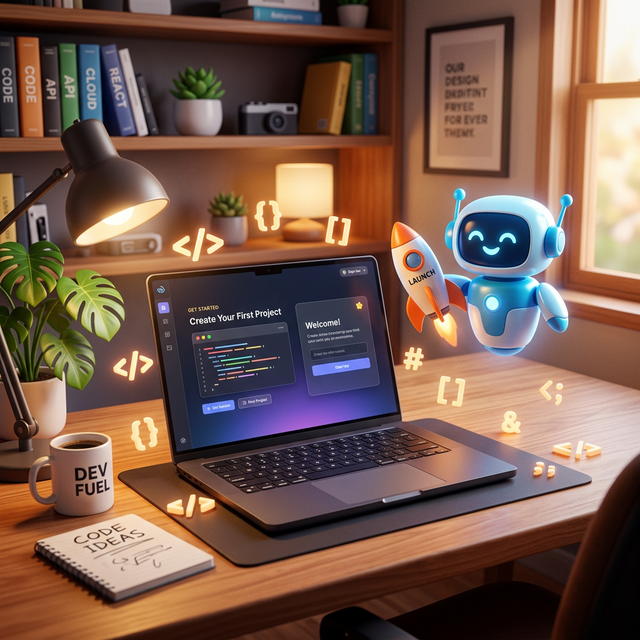

#  DevLaunch — Professional Localhost Orchestrator

[]()
[]()
[]()

**DevLaunch** là giải pháp quản trị quy trình làm việc (workflow) tối thượng dành cho các nhà phát triển phần mềm hiện đại. Được xây dựng trên nền tảng Electron với triết lý thiết kế tinh giản, DevLaunch biến việc quản lý hàng chục tiến trình `localhost` phức tạp trở thành một trải nghiệm mượt mà và đầy cảm hứng.



---

## 💎 Điểm Nhấn Công Nghệ

| Tính năng | Mô tả chuyên sâu |
| :--- | :--- |
| **Smart Process Manager** | Quản lý vòng đời tiến trình (Start/Stop/Restart) với cơ chế giải phóng Resource triệt để. |
| **Neural URL Detection** | Tự động nhận diện và trích xuất URL (Local/Network) từ log hệ thống bằng thuật toán Regex chính xác. |
| **Fluid UI/UX** | Giao diện hiện đại, hỗ trợ **Kéo & Thả (Drag & Drop)** mượt mà để tùy biến thứ tự công việc. |
| **Real-time Console** | Hệ thống stream log thời gian thực với mã màu trực quan, hỗ trợ tương tác Shell trực tiếp. |
| **Enterprise Backup** | Xuất nhập cấu hình dự án cực nhanh, đảm bảo tính di động của môi trường làm việc. |
| **Antigravity Sync** | Tích hợp sâu với hệ sinh thái Antigravity, mở dự án chỉ với một cú click. |

---

## 🛠 Yêu Cầu Hệ Thống

*   **Runtime:** Node.js v18.x hoặc cao hơn.
*   **OS:** Windows 10/11 (Hỗ trợ tốt nhất cho môi trường x64).
*   **Build Tools:** `npm` hoặc `pnpm` (Khuyến nghị).

---

## 🚀 Triển Khai Nhanh

### 1. Cài đặt Phụ thuộc
Mở terminal tại thư mục gốc của dự án và khởi chạy quy trình thiết lập:
```bash
npm install
```

### 2. Khởi chạy Ứng dụng
Kích hoạt môi trường thực thi Electron:
```bash
npm start
```

---

## 📦 Đóng gói & Phân phối (Production)

Để tạo bản cài đặt chuyên nghiệp (`.exe`) cho Windows, hãy sử dụng quy trình xây dựng tối ưu hóa:

```bash
# Tạo bản Installer & Portable
npm run build
```
Sản phẩm cuối cùng sẽ được xuất ra thư mục `dist/` với đầy đủ logo và cấu hình hệ thống.

---

## 📖 Hướng Dẫn Vận Hành Hệ Thống

### Khởi tạo Service
Hệ thống hỗ trợ cả **Quick Add** (Thêm nhanh tại tiêu đề) và **Full Configuration** (Cấu hình chi tiết qua Modal):
- **Command Line:** Hỗ trợ mọi loại shell command (npm, yarn, python, go, docker, v.v.).
- **Directory:** Tự động chuẩn hóa đường dẫn Windows, hỗ trợ ký tự `~`.
- **Dynamic Port:** Tự động giải phóng cổng kết nối nếu phát hiện tiến trình bị treo.

### Quản trị Dự án
- **Project Groups:** Tự động gom nhóm dựa trên tên dự án.
- **Batch Actions:** Điều khiển hàng loạt (Start/Stop All) chỉ với một thao tác.
- **Visual Feedback:** Hệ thống màu sắc giúp phân biệt trạng thái (Starting, Running, Error, Stopped).

---

## 🛡 Bảo mật & Dữ liệu

Dữ liệu cấu hình được lưu trữ cục bộ một cách an toàn tại:
`%AppData%/Roaming/devlaunch/services.json`

Chúng tôi cam kết bảo mật tuyệt đối: **Không** gửi dữ liệu ra ngoài, **Không** thu thập thông tin người dùng. Mọi thứ đều nằm trong quyền kiểm soát của bạn.

---

## 🤝 Đóng góp & Phát triển

Dự án này được tối ưu hóa cho hiệu suất cao. Nếu bạn phát hiện lỗi hoặc muốn bổ sung tính năng:
1. Fork dự án.
2. Tạo Brand mới (`git checkout -b feature/AmazingFeature`).
3. Commit thay đổi (`git commit -m 'Add some AmazingFeature'`).
4. Push lên Branch và mở một Pull Request.

---

<div align="center">
  <p>Được kiến tạo với tâm huyết bởi <strong>Antigravity Team</strong></p>
  <p><i>"Nâng tầm hiệu suất khởi đầu cho mọi dự án đỉnh cao."</i></p>
</div>
